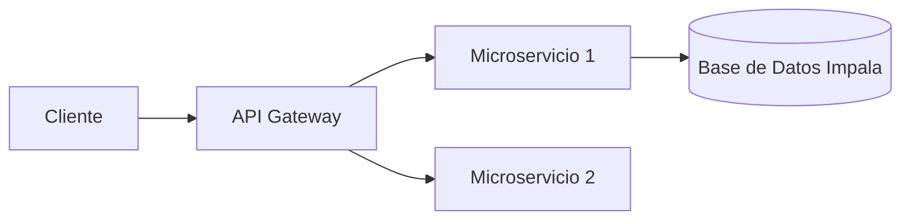

**Proyecto Nombre**  
Una breve descripción de alto nivel del proyecto y su propósito.

<p align="center">
  <!-- Badges -->  
  
  
  
  <a href="https://github.com/usuario/proyecto/actions"></a>
</p>

---

<details>
  <summary>📑 Índice</summary>

  <table>
    <tr>
      <td>[🌟 Visión General](#vision-general)</td>
      <td>[🚀 Características](#caracteristicas-principales)</td>
      <td>[⚙️ Requisitos](#requisitos)</td>
    </tr>
    <tr>
      <td>[🔧 Instalación](#instalacion)</td>
      <td>[▶️ Uso](#uso)</td>
      <td>[🗺️ Arquitectura](#arquitectura)</td>
    </tr>
    <tr>
      <td>[🔍 Ejemplos](#ejemplos)</td>
      <td>[✨ Prácticas](#buenas-practicas)</td>
      <td>[🤝 Contribuir](#contribuir)</td>
    </tr>
    <tr>
      <td>[🧪 Tests](#tests)</td>
      <td>[📜 Licencia](#licencia)</td>
      <td>[📞 Contacto](#contacto)</td>
    </tr>
  </table>
</details>

<a name="vision-general"></a>
## 🌟 Visión General
Describe en 2–3 líneas el propósito, público objetivo y solución que ofrece el proyecto.

<a name="caracteristicas-principales"></a>
## 🚀 Características Principales
| Feature           | Descripción breve                  |
| ----------------- | ---------------------------------- |
| 🚀 Rendimiento    | Carga < 200ms                      |
| 🔒 Seguridad      | Autenticación JWT + OAuth2         |
| 📈 Monitorización | Métricas en Prometheus + Grafana   |
| 🤖 Automatización | Pipelines CI/CD con GitHub Actions |

<a name="requisitos"></a>
## ⚙️ Requisitos
- **SO**: Windows, macOS o Linux
- **Node.js** ≥ 16.x / **Python** ≥ 3.8
- **Base de Datos**: Impala (SQL)
- **IDE**: Visual Studio Code

<a name="instalacion"></a>
## 🔧 Instalación
```bash
# Clonar y entrar al repo
git clone https://github.com/usuario/proyecto.git && cd proyecto

# Instalar dependencias
npm install    # o pip install -r requirements.txt
```
<details>
  <summary>Con Docker</summary>
  ```bash
  docker-compose up -d --build
  ```
</details>

<a name="uso"></a>
## ▶️ Uso
```bash
# Iniciar servidor local
npm start    # o python app.py
```
- Visitar: `http://localhost:3000`

<a name="arquitectura"></a>
## 🗺️ Arquitectura


<a name="ejemplos"></a>
## 🔍 Ejemplos

```bash
# Ejecutar ejemplo
npm run ejemplo -- --opcion=valor
```

<a name="buenas-practicas"></a>
## ✨ Buenas Prácticas
- Usa [Conventional Commits](https://www.conventionalcommits.org/)
- Formatea código con Prettier / Black
- Escanea vulnerabilidades con Snyk

<a name="contribuir"></a>
## 🤝 Contribuir
1. Fork  
2. Crear branch: `git checkout -b feature/nueva`  
3. Commit: `git commit -m "feat: descripción corta"`  
4. Push & Pull Request

<a name="tests"></a>
## 🧪 Tests
```bash
# Ejecutar tests
tnpm test    # o pytest
```

<a name="licencia"></a>
## 📜 Licencia
MIT © [Tu Nombre](https://tu-web.com)

<a name="contacto"></a>
## 📞 Contacto
- Twitter: [@tu_usuario](https://twitter.com/tu_usuario)  
- Email: [tu.email@dominio.com](mailto:tu.email@dominio.com)

