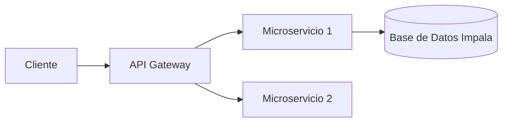

**Proyecto Nombre**\
Una breve descripción de alto nivel del proyecto y su propósito.

---

## 📑 Tabla de Contenidos

- [🎯 Visión General](#visión-general)
- [🚀 Características Principales](#características-principales)
- [⚙️ Requisitos](#requisitos)
- [🔧 Instalación](#instalación)
- [▶️ Uso](#uso)
- [🔍 Ejemplos](#ejemplos)
- [🗺️ Arquitectura](#arquitectura)
- [🛠️ Configuración](#configuración)
- [📊 Diagramas](#diagramas)
- [✨ Buenas Prácticas](#buenas-prácticas)
- [🤝 Contribuir](#contribuir)
- [🧪 Tests](#tests)
- [📜 Licencia](#licencia)
- [📞 Contacto](#contacto)

---

## 🎯 Visión General

Describe en 2–3 líneas el propósito, público objetivo y solución que ofrece el proyecto.

## 🚀 Características Principales

| Feature           | Descripción breve                  |
| ----------------- | ---------------------------------- |
| 🚀 Rendimiento    | Carga < 200ms                      |
| 🔒 Seguridad      | Autenticación JWT + OAuth2         |
| 📈 Monitorización | Métricas en Prometheus + Grafana   |
| 🤖 Automatización | Pipelines CI/CD con GitHub Actions |

## ⚙️ Requisitos

- **Sistema Operativo**: Windows, macOS o Linux
- **Node.js** ≥ 16.x / **Python** ≥ 3.8
- **Base de Datos**: Impala (SQL)
- **Herramientas**: Visual Studio Code

## 🔧 Instalación

```bash
# Clonar el repositorio
git clone https://github.com/usuario/proyecto.git
cd proyecto

# Instalar dependencias (Node.js / Python)
npm install    # o pip install -r requirements.txt
```

```bash
docker-compose up -d --build
```

## ▶️ Uso

```bash
# Iniciar servidor local
npm start    # o python app.py
```

- Accede en: `http://localhost:3000`

## 🔍 Ejemplos


```bash
# Ejecutar ejemplo específico
npm run ejemplo -- --opcion=valor
```

## 🗺️ Arquitectura



## 🛠️ Configuración

Edita el archivo `.env` con tus credenciales:

```ini
DB_HOST=localhost
DB_PORT=21050
DB_USER=usuario
DB_PASS=******
```

## 📊 Diagramas

Incluye diagramas de flujo, entidad-relación y despliegue.

## ✨ Buenas Prácticas

- Sigue [Conventional Commits](https://www.conventionalcommits.org/)
- Formatea con Prettier / Black
- Revisa seguridad con Snyk o similar

## 🤝 Contribuir

1. Haz **fork**
2. Crea tu **branch**: `git checkout -b feature/nueva`
3. Realiza **commit**: `git commit -m "feat: descripción corta"`
4. Push y **pull request**

---

## 🧪 Tests

```bash
# Ejecutar suite completa
npm test    # o pytest
```

## 📜 Licencia

MIT © [Tu Nombre](https://tu-web.com)

## 📞 Contacto

- Twitter: [@tu\_usuario](https://twitter.com/tu_usuario)
- Email: [tu.email@dominio.com](mailto\:tu.email@dominio.com)

